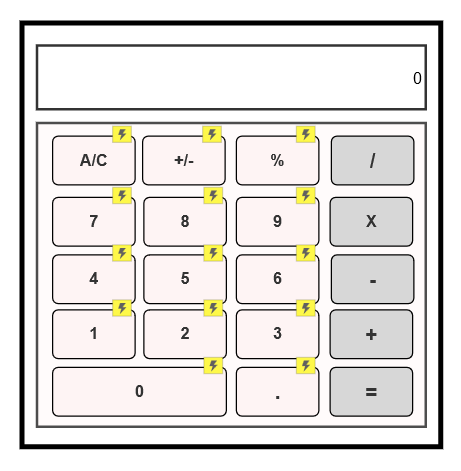

# IT3213_Calculator

# Axure RP 9 – Calculator Project  

## 📝 Introduction  
This project is a Calculator designed and developed using Axure RP 9. The goal is to enhance prototyping skills and demonstrate the implementation of dynamic panels, interactions, and user-friendly UI/UX design within Axure RP.  

---

## 🌟 Features  
- **Basic Arithmetic Operations**: Addition, Subtraction, Multiplication, and Division  
- **Interactive Buttons**: Number keys (0-9), Clear, Equals, and Operators  
- **Dynamic Display Panel**: Shows user inputs and calculated results  
- **Responsive UI**: Optimized layout for consistent interaction  

---

## 🛠 Tools and Technologies  
- **Axure RP 9** – For designing, prototyping, and interaction mapping
---

## 🚀 How to Use the Calculator Prototype  
1. Download the **`cal.rp`** file from this repository.  
2. Open **Axure RP 9** on your computer.  
3. Navigate to `File > Open` and select the downloaded `.rp` file.  
4. Click on the **Preview** button in Axure to run and interact with the calculator prototype.  

---

## Output
### 1. **Calculator**

